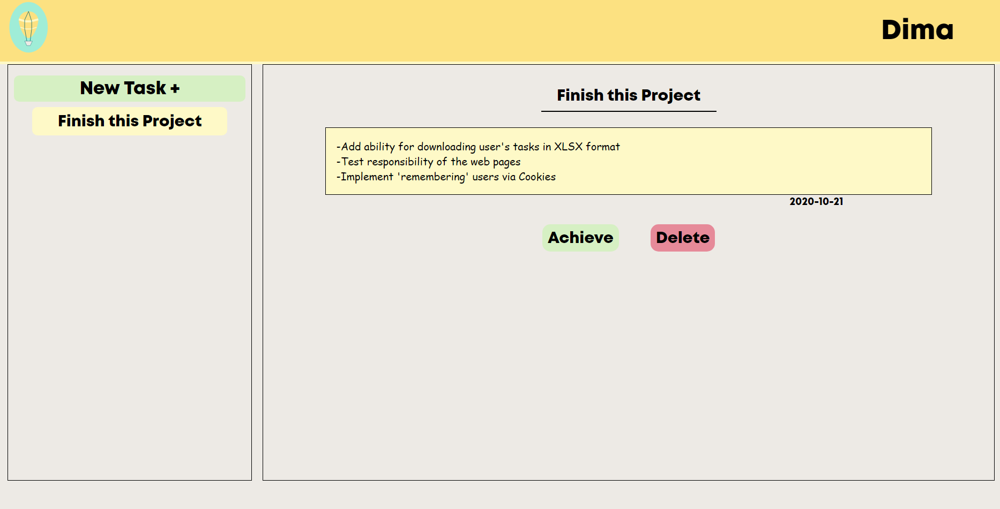
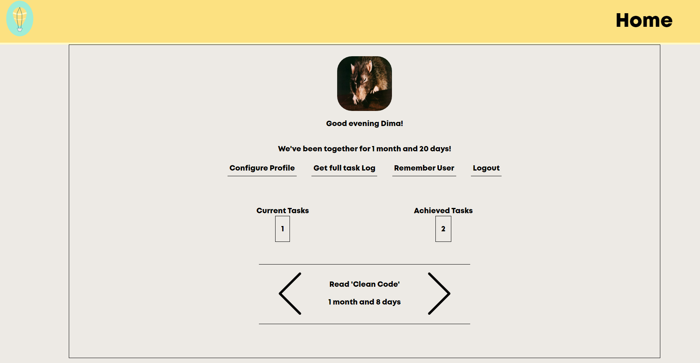
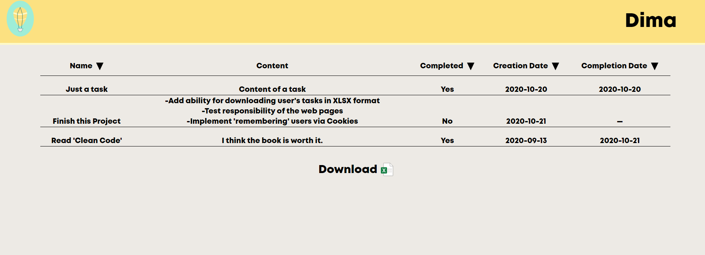

## Bright Stream 

---
Simple task management web application built on Servlets and JSP.

### Technologies used:
* Backend
    * Servlets & JSP
    * JSTL
    * JDBC
    * MySQL
* Frontend    
    * AJAX
    * jQuery

### Features

* User registration and authentication
* Task management
  * Adding
  * Deleting or marking as "achieved"
  * Downloading full log of tasks in XLSX format

### Showcase





### How to import
1. Supply DB connection credentials in ```com.ldp.brightstream.DAL.ConnectionPool```
2. Run Maven Jetty plugin

#### DB schema
User table:
<pre>
+-------------------+-----------------------+------+-----+-------------------+----------------+
| Field             | Type                  | Null | Key | Default           | Extra          |
+-------------------+-----------------------+------+-----+-------------------+----------------+
| user_id           | mediumint(8) unsigned | NO   | PRI | NULL              | auto_increment |
| user_name         | varchar(45)           | NO   | MUL | NULL              |                |
| email             | varchar(55)           | NO   |     | NULL              |                |
| avatar_path       | varchar(1024)         | YES  |     | NULL              |                |
| registration_time | timestamp             | NO   |     | CURRENT_TIMESTAMP |                |
| password          | varchar(256)          | YES  |     | NULL              |                |
+-------------------+-----------------------+------+-----+-------------------+----------------+
</pre>
Task table:
<pre>
+-----------------+-----------------------+------+-----+-------------------+----------------+
| Field           | Type                  | Null | Key | Default           | Extra          |
+-----------------+-----------------------+------+-----+-------------------+----------------+
| task_id         | mediumint(8) unsigned | NO   | PRI | NULL              | auto_increment |
| user_id         | mediumint(8) unsigned | NO   | MUL | NULL              |                |
| name            | varchar(40)           | NO   |     | NULL              |                |
| content         | text                  | NO   |     | NULL              |                |
| completed       | tinyint(1)            | NO   |     | 0                 |                |
| creation_time   | timestamp             | NO   |     | CURRENT_TIMESTAMP |                |
| completion_time | timestamp             | YES  |     | NULL              |                |
+-----------------+-----------------------+------+-----+-------------------+----------------+
</pre>

